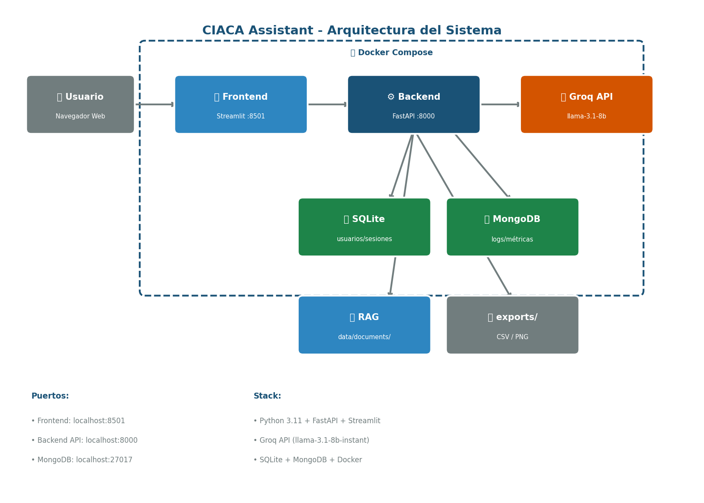

# 🏛️ CIACA Assistant

Asistente de IA para el Centro de Inteligencia Artificial y Analítica para la Convivencia de Antioquia - Gobernación de Antioquia.

## 🚀 Instalación rápida

### Requisitos
- Python 3.11+
- MongoDB corriendo en localhost:27017
- Docker Desktop (opcional)

### Pasos

1. Clonar el repositorio:
```bash
git clone https://github.com/santiarcila23/ciaca-assistant.git
cd ciaca-assistant
```

2. Crear entorno virtual:
```bash
python -m venv venv
venv\Scripts\activate  # Windows
source venv/bin/activate  # Linux/Mac
```

3. Instalar dependencias:
```bash
pip install -r backend/requirements.txt
```

4. Configurar variables de entorno:
```bash
cp .env.example .env
# Editar .env con tu GROQ_API_KEY
```

5. Iniciar backend:
```bash
cd backend
uvicorn main:app --reload --port 8000
```

6. Iniciar frontend:
```bash
cd frontend
streamlit run app.py
```

## 🐳 Con Docker
```bash
docker-compose up --build
```

## 🔑 Variables de entorno

| Variable | Descripción |
|----------|-------------|
| GROQ_API_KEY | API Key de Groq (obligatoria) |
| GROQ_MODEL | Modelo a usar (default: llama-3.1-8b-instant) |
| APP_TOKEN | Token de autenticación |
| MONGO_URI | URI de MongoDB |
| DB_NAME | Nombre de la base de datos |

## 👥 Usuarios de prueba

| Usuario | Token | Rol |
|---------|-------|-----|
| admin | ciaca2024secreto | Administrador |

## 🏗️ Arquitectura
```
ciaca-assistant/
├── backend/                  # FastAPI + LLM + RAG
│   ├── main.py               # API principal con todos los endpoints
│   ├── chat.py               # Chat con Groq y streaming
│   ├── rag.py                # RAG con carga dinámica de documentos
│   ├── database.py           # SQLite + MongoDB
│   ├── etl.py                # Pipeline de datos
│   ├── schema.sql            # Esquema y consultas SQL
│   ├── mongo_queries.py      # Consultas MongoDB
│   └── tests.py              # Pruebas unitarias
├── frontend/                 # Streamlit UI
│   └── app.py                # Interfaz completa
├── data/
│   └── documents/            # PDFs y TXTs para RAG
├── exports/                  # Reportes CSV y PNG generados
├── docker-compose.yml        # Orquestación de contenedores
├── setup_linux.sh            # Script instalación Ubuntu Server
├── ciaca.service             # Servicio systemd para Linux
├── architecture.png          # Diagrama de arquitectura
└── design.pdf                # Documento de decisiones técnicas
```



## ⚙️ Decisiones técnicas

- **LLM:** Groq API con modelo llama-3.1-8b-instant (gratis, baja latencia ~0.7s)
- **RAG:** Búsqueda por palabras clave con chunks de 500 caracteres
- **Carga dinámica:** Los usuarios pueden subir PDFs y TXTs directamente desde la interfaz para consultarlos en el RAG
- **Streaming:** Las respuestas del chat general aparecen en tiempo real letra por letra
- **Embeddings:** Búsqueda léxica simple (sin vectores) para reducir costo
- **Base de datos:** SQLite para datos relacionales, MongoDB para logs
- **Frontend:** Streamlit por simplicidad y rapidez de desarrollo
- **Seguridad:** Token Bearer, filtros PII/SQLi, límite de tokens

## ⏱️ Tiempo invertido

- Backend (FastAPI + LLM + RAG): 3 horas
- Frontend (Streamlit): 2 horas
- Docker + Scripts: 1 hora
- Documentación + Tests: 1 hora
- **Total: ~7 horas**

## 🔄 Segunda iteración

- Embeddings reales con ChromaDB
- Autenticación JWT completa
- CI/CD con GitHub Actions
- Nginx como reverse proxy
- Base de datos vectorial para persistir el índice RAG

## 📄 Licencia

MIT